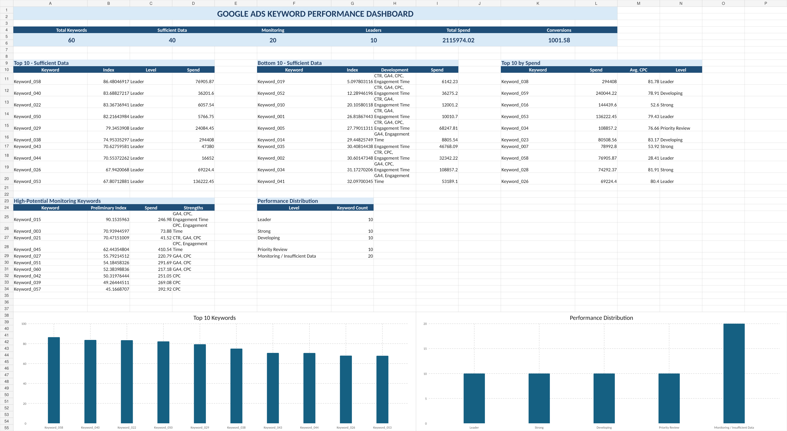

# Google Ads Keyword Performance Analyzer

A privacy-safe Python decision-support project for evaluating Google Ads keyword performance with:

- configurable minimum-spend filtering,
- continuous 0–100 KPI scoring,
- Analytic Hierarchy Process (AHP) weighting,
- consistency and sensitivity analysis,
- automated management-ready Excel dashboards.

> **Privacy note:** This repository contains only synthetic sample data. No company names, real keywords, campaign names, costs, or internal performance values are included.



## Project scope

This repository covers the analysis and dashboard stage only. It does **not** generate new keywords or connect to the Google Ads API.

### Workflow

```text
Google Ads export
        ↓
Data validation
        ↓
Configurable data-sufficiency threshold
        ↓
Continuous KPI scoring
        ↓
AHP weighting
        ↓
Performance index
        ↓
Sensitivity analysis
        ↓
Excel dashboard
```

## KPIs

- CTR
- GA4 engagement rate
- average CPC
- average engagement time
- conversions as a supporting reporting metric

## Methodology

Keywords below the configurable minimum-spend threshold are kept in a monitoring group and excluded from the main ranking.

Eligible keywords receive continuous percentile-based scores between 0 and 100. Average CPC is reverse-scored because lower values are preferable. The KPI scores are combined using AHP weights.

The pairwise comparison matrix is validated with the consistency ratio. The default configuration produces a consistency ratio below 0.10.

## Repository structure

```text
.
├── src/
│   └── analyzer.py
├── sample_data/
│   └── google_ads_sample.xlsx
├── sample_output/
│   └── sample_dashboard.xlsx
├── images/
│   └── dashboard_preview.png
├── requirements.txt
├── .gitignore
├── LICENSE
└── README.md
```

## Installation

```bash
git clone <repository-url>
cd google-ads-keyword-performance-analyzer
python -m venv .venv
```

Windows:

```bash
.venv\Scripts\activate
pip install -r requirements.txt
```

macOS/Linux:

```bash
source .venv/bin/activate
pip install -r requirements.txt
```

## Usage

Run with the included synthetic sample:

```bash
python src/analyzer.py
```

Use a different file and threshold:

```bash
python src/analyzer.py \
  --input path/to/google_ads_export.xlsx \
  --output path/to/report.xlsx \
  --min-spend 500
```

## Required input columns

The analyzer expects the following Google Ads export headers:

```text
Arama anahtar kelimesi
Göstr.
Tıklamalar
TO
Etkileşim sağlanan oturum yüzdesi (GA4)
Maliyet
Ort. TBM
Oturum başına ort. etkileşim süresi (saniye) (GA4)
Dönüşümler
```

## Output sheets

- **Anahtar Kelime Analizi:** raw KPIs, continuous scores, data sufficiency, ranking, strengths and development areas.
- **Dashboard:** top, bottom and high-spend keywords, monitoring candidates and visual summaries.
- **Metodoloji:** correlations, AHP weights, consistency measures and sensitivity analysis.

## Privacy and responsible use

Never commit real advertising exports, company-specific keywords, campaign names, customer information or internal performance reports.

Recommended workflow:

1. Keep real data outside the repository.
2. Add local data folders to `.gitignore`.
3. Use synthetic data for screenshots and examples.
4. Review exported workbooks before sharing.
5. Do not mention the company or client in the repository unless written permission exists.

## Limitations

- The performance index is a decision-support score, not a causal model.
- New keywords without historical performance cannot be evaluated with this index.
- A minimum-spend threshold improves comparability but does not guarantee statistical significance.
- KPI weights should be reviewed when the business objective or sector changes.

## License

MIT License.
